## Object detection

### Project overview
This project aims to create a training pipeline for the automatic detection of objects.
With object detection, smart cars can avoid collisions with other road users and pedestrians.
The 360 degree camera views could in theory perform better than a human in the real time detection
of hazards. This hazard perception is an essential part of self-driving systems.

### Set up
Make sure Nvidia Drivers 460.91.03 and CUDA 11.2 are installed.

Build the Docker image with:
```
docker build -t project-dev -f Dockerfile .
```

Create a container with:
```
docker run --gpus all -v <PATH TO LOCAL PROJECT FOLDER>:/app/project/ --network=host -ti project-dev bash
```

Launch the reference training process with:
```
python experiments/model_main_tf2.py --model_dir=experiments/reference/ --pipeline_config_path=experiments/reference/pipeline_new.config
```

Launch the improved experiment training process with:
```
python experiments/model_main_tf2.py --model_dir=experiments/experiment2/ --pipeline_config_path=experiments/experiment2/pipeline_new.config
```
### Dataset
#### Dataset analysis
A random selection of 10 labelled images from the training set are shown below.
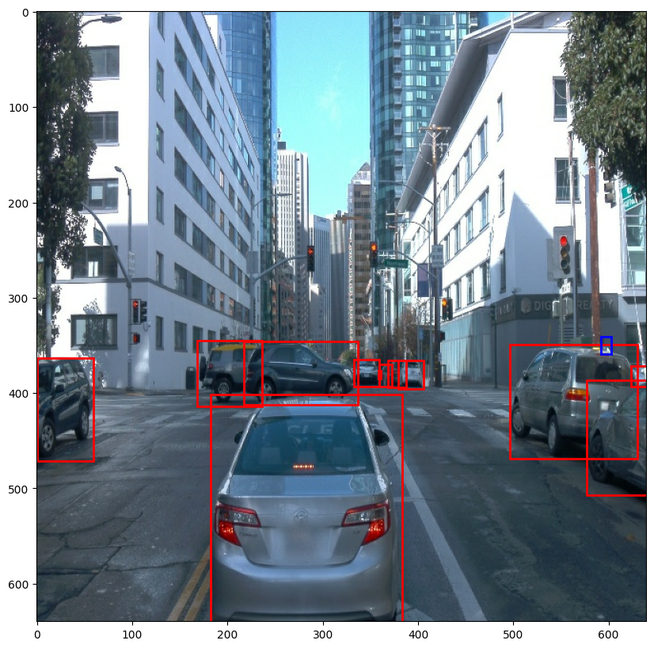
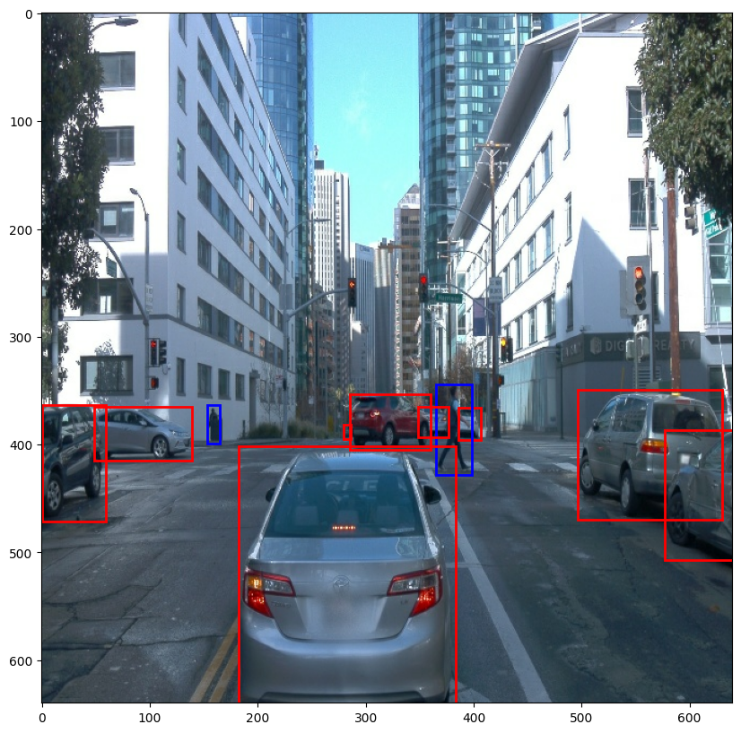
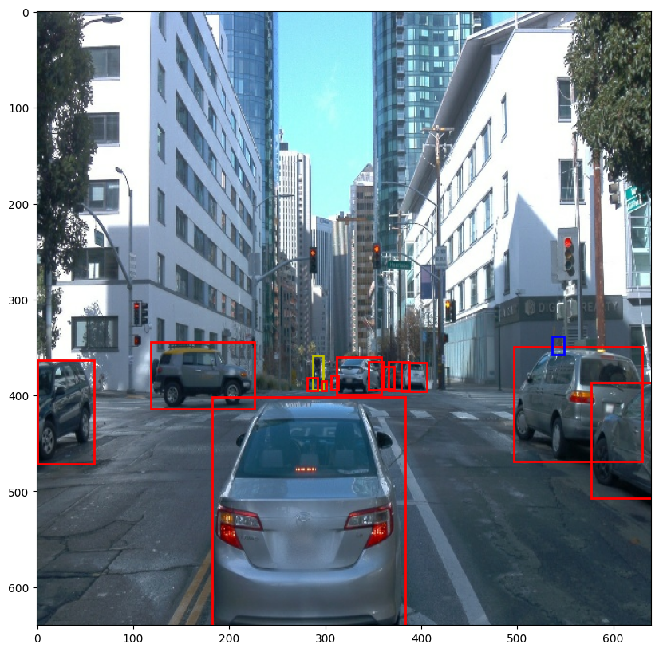
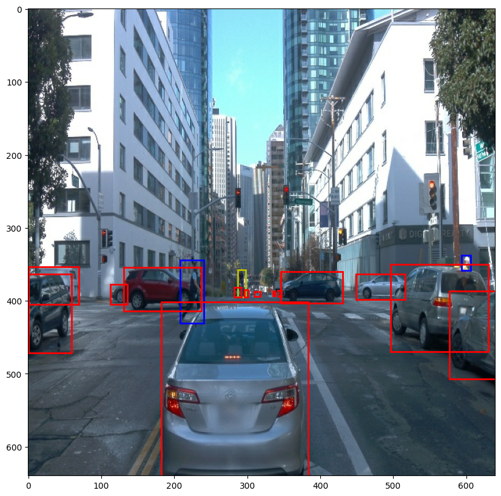

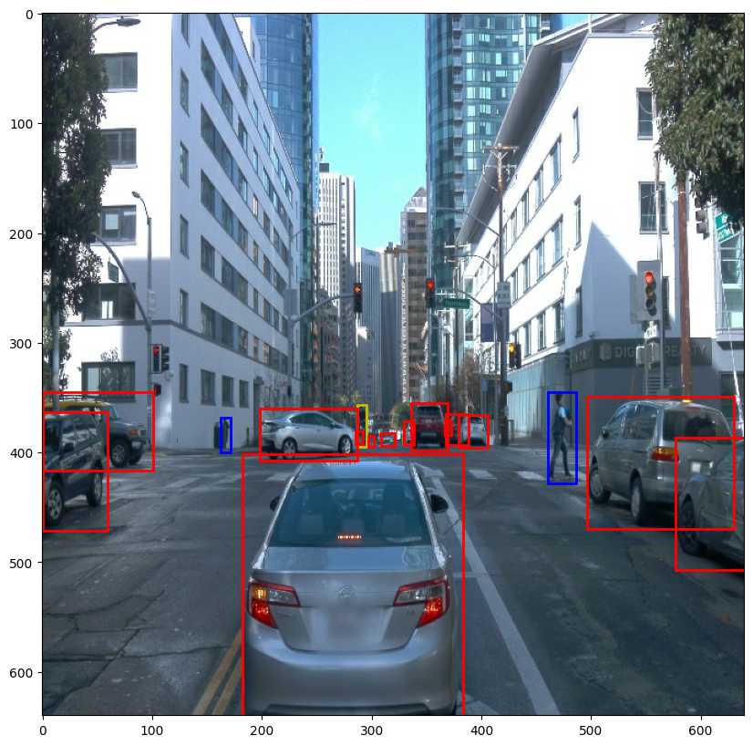
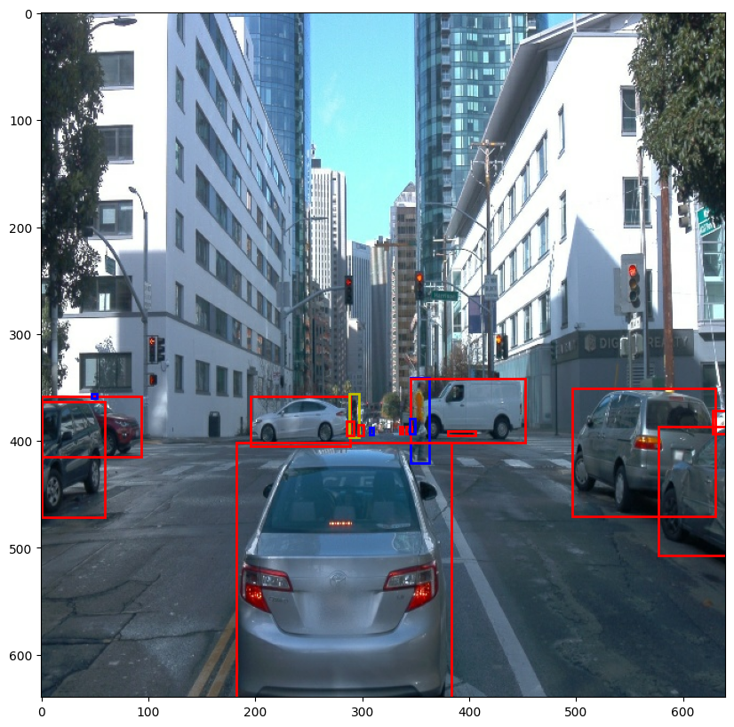
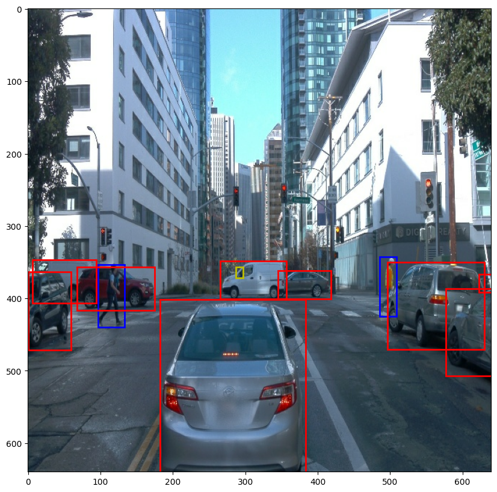
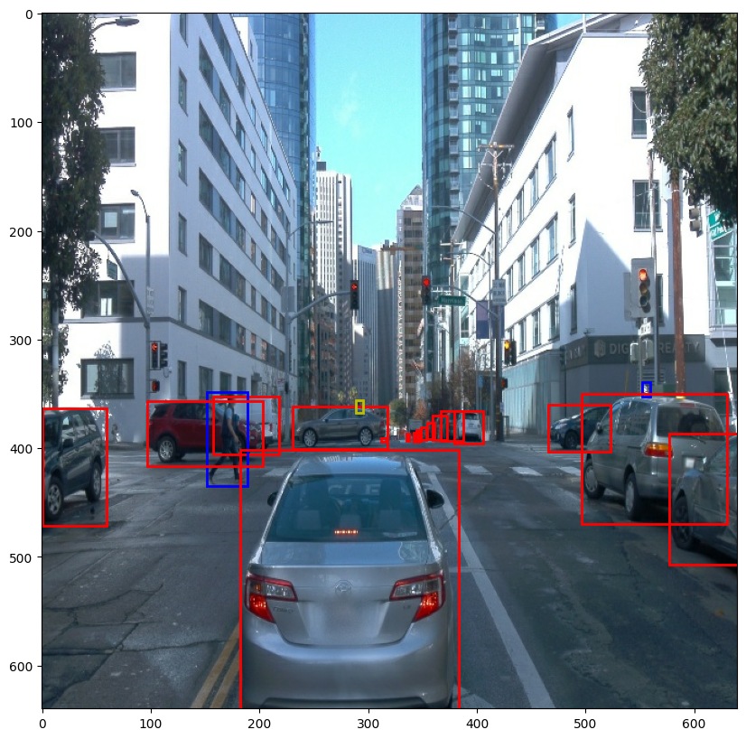
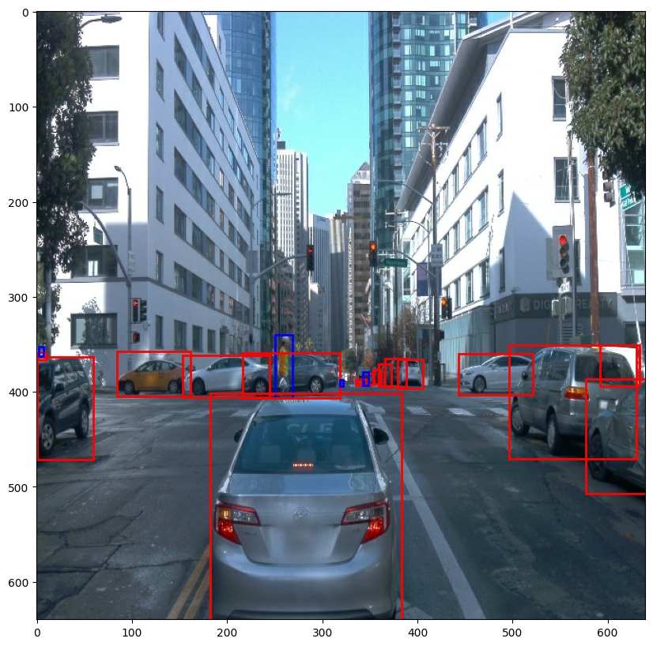

The class distribution in the dataset is shown below:
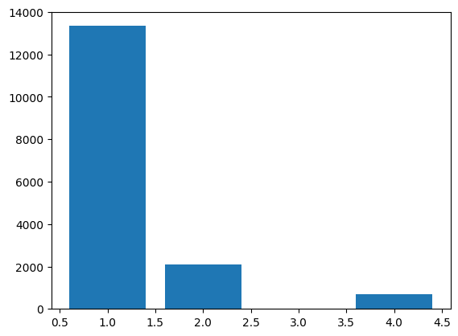

The distribution of the amount of instances of class 1 in each image is shown below:
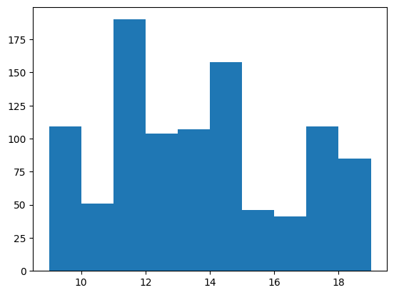


#### Cross validation
The cross validation strategy involves the use of a separate validation set. It is important to verify that the loss and performance metrics such as the mean average
precision (mAP) are consistent among the training and validation sets. After the training is completed, the
performance is evaluated on the validation set using the final model.

### Training
#### Reference experiment
The training metrics consist of the:
- Classification loss: related to the given label of the object contained in the detected box.
- Localization loss: related to the overlap of the detected bounding box and the labeled box.
- Regularization loss: This is the L1 regularisation term as the sum of the weights.

The loss curves for the reference experiment is shown below:
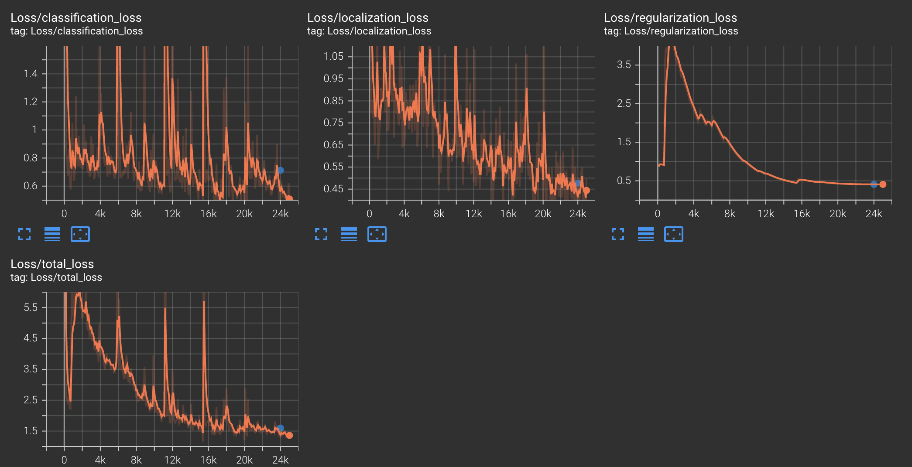

The blue points in the loss curves from the validation set can be seen to be in good agreement with the training data, showing no signs of overfitting.

The table of performance is shown below for small, medium, and large objects:
| Metric | Small | Medium | Large |
| ------- | ------ | ----- | ----- |
| mAP | 0.00 | 0.06 | 0.42 |
| Recall | 0.02 | 0.17 | 0.64 |

#### Improve on the reference
In order to improve the performance, the following improvements were tried:
- The addition of random jpeg quality.
- Modifying the optimizer to Adam instead of the momentum optimizer.

The former was found to improve performance.

The loss curves for the improved pipeline is shown below:
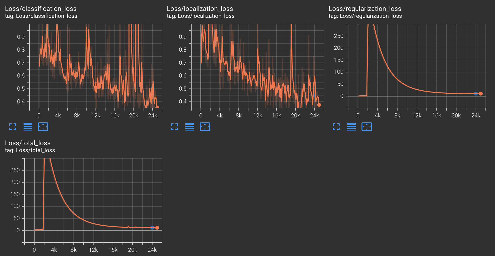

The blue points in the loss curves from the validation set can be seen to be in good agreement with the training data, showing no signs of overfitting.

The table of performance is shown below for small, medium, and large objects:
| Metric | Small | Medium | Large |
| ------- | ------ | ----- | ----- |
| mAP | 0.01 | 0.16 | 0.50 |
| Recall | 0.05 | 0.25 | 0.66 |
